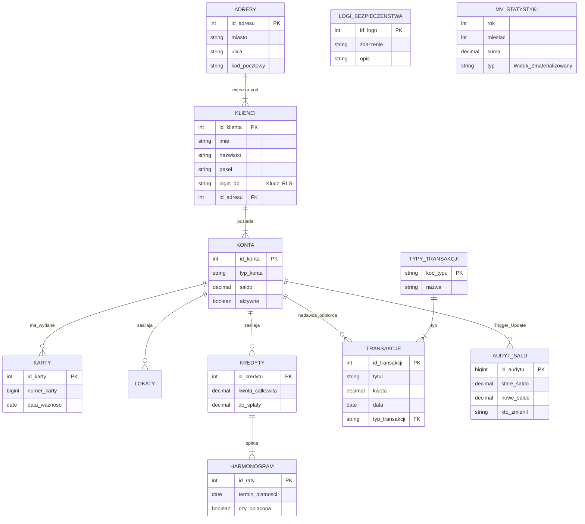

# Projekt Bazy Danych: System Bankowy

Projekt zaliczeniowy symulujący działanie bazy danych dla banku. System obsługuje klientów, konta, karty płatnicze, kredyty, lokaty oraz historię transakcji.

* Piotr Kurbiel
* Marcel Kuźma
* Antoni Pietreszewski

---

## O projekcie
Baza została oparta na silniku **PostgreSQL**. Skupiliśmy się na odwzorowaniu realnych procesów bankowych (przelewy, naliczanie odsetek, spłata rat) oraz na aspektach bezpieczeństwa danych i wydajności.

W bazie znajduje się generator danych, który automatycznie tworzy 50 klientów i 100 000 transakcji do testów.

## Zaimplementowane funkcjonalności

1.  **Struktura danych:**
    * Powyżej 10 tabel powiązanych relacjami.
    * Słowniki (np. typy transakcji, adresy).
    * Ograniczenia integralności (`CHECK`, `FOREIGN KEY`).

2.  **Logika biznesowa (PL/pgSQL):**
    * **Procedury:** `wykonaj_przelew` (transakcyjnie bezpieczne przekazywanie środków).
    * **Triggery:**
        * Automatyczne przypisywanie konta "Młodzieżowe" dla osób < 26 lat.
        * Walidacja dat ważności kart i lokat.
        * Aktualizacja salda kredytu po spłacie raty.

3.  **Bezpieczeństwo i RODO:**
    * **RLS (Row Level Security):** Zaimplementowano polityki bezpieczeństwa, dzięki którym zalogowany klient widzi *tylko* swoje dane (konta, karty, historię), a nie dane innych klientów.
    * **Maskowanie danych:** Widok `v_klienci_rodo` dla pracowników banku (ukryty PESEL).
    * **Role:** Podział na role `role_klient`, `role_pracownik`, `role_kierownik`.

4.  **Audyt i Logi:**
    * Tabela `audyt_sald` rejestruje każdą zmianę na koncie (trigger `AFTER UPDATE`), zapisując stare i nowe saldo oraz użytkownika wykonującego zmianę.
    * Tabela `logi_bezpieczenstwa` do monitorowania zdarzeń.

5.  **Wydajność i Analityka:**
    * **Indeksy:** Założone na kluczowych kolumnach (PESEL, daty, typy transakcji).
    * **Widoki Zmaterializowane:** `mv_statystyki_miesieczne` do szybkiego raportowania.
    * **Funkcje Okna:** Raporty analityczne (rankingi klientów, analiza trendów wydatków).

---

## Jak uruchomić projekt

Wymagany jest Docker oraz Docker Compose.

1.  **Postawienie bazy:**
    W terminalu w folderze projektu wpisz:
    ```bash
    docker-compose up -d
    ```

2.  **Wgranie struktury i danych:**
    Należy uruchomić skrypty z folderu `sql/` w kolejności numerycznej (od 01 do 19).
    * Skrypty 01-08: Tworzenie tabel.
    * Skrypty 09-12: Triggery.
    * Skrypt 13: Procedury.
    * Skrypt 14: **Generator danych** (tworzy klientów i 100k transakcji).
    * Skrypty 15-19: Audyt, Role, RLS, Indeksy i Raporty.

---

## Struktura plików
* `sql/` - wszystkie skrypty SQL.
* `sql/testy_wydajnosci/` - skrypty `EXPLAIN ANALYZE` dowodzące działania indeksów.
* `dokumentacja.pdf` - pełna dokumentacja techniczna projektu.
* `docker-compose.yml` - konfiguracja kontenera bazy danych.

---

## Schemat bazy danych
Diagram ERD (Entity Relationship Diagram) obrazuje on powiązania między klientami, produktami bankowymi a modułem bezpieczeństwa.

